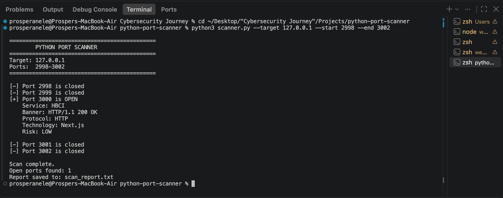

# Python Port Scanner

A Python-based defensive cybersecurity tool that scans TCP (Transmission Control Protocol) ports on an authorised target and identifies open services.

## Features

•⁠  ⁠TCP port scanning
•⁠  ⁠Configurable port ranges
•⁠  ⁠Service identification
•⁠  ⁠HTTP banner grabbing
•⁠  ⁠HTTP protocol detection
•⁠  ⁠Basic web technology detection
•⁠  ⁠Basic risk classification
•⁠  ⁠Scan report generation
•⁠  ⁠Command-line interface
•⁠  ⁠Input validation and error handling

## Technologies

•⁠  ⁠Python 3
•⁠  ⁠Python ⁠ socket ⁠
•⁠  ⁠Python ⁠ argparse ⁠
•⁠  ⁠TCP/IP networking
•⁠  ⁠HTTP

## Usage

```bash
python3 scanner.py --target <IP> --start <PORT> --end <PORT>
```
### Example

```bash
python3 scanner.py --target 127.0.0.1 --start 2998 --end 3002
```

## Testing

The scanner was tested against a locally hosted application using:

•⁠  ⁠Target: ⁠ 127.0.0.1 ⁠
•⁠  ⁠Port range: ⁠ 2998-3002 ⁠

The scanner successfully identified port ⁠ 3000 ⁠ as open and detected the HTTP protocol and Next.js technology.

## Security Considerations

This project is intended for authorised defensive security testing and educational purposes.

Only scan systems and networks where you have explicit permission to perform security testing.

## Limitations

•⁠  ⁠TCP connect scanning only
•⁠  ⁠Basic banner detection
•⁠  ⁠Basic technology identification
•⁠  ⁠No UDP scanning
•⁠  ⁠No vulnerability exploitation
•⁠  ⁠Risk classification is informational

## Future Improvements

•⁠  ⁠Multithreaded scanning
•⁠  ⁠Improved service detection
•⁠  ⁠JSON report generation
•⁠  ⁠CSV report generation
•⁠  ⁠More detailed HTTP fingerprinting
•⁠  ⁠Configurable scan timeouts
•⁠  ⁠Unit tests
•⁠  ⁠Improved risk classification

## Scan Results

The scanner was tested against a locally hosted application on ⁠ 127.0.0.1 ⁠.

The test successfully identified an open TCP port and detected the associated HTTP service and Next.js technology.



## Author 
Prosper Anele